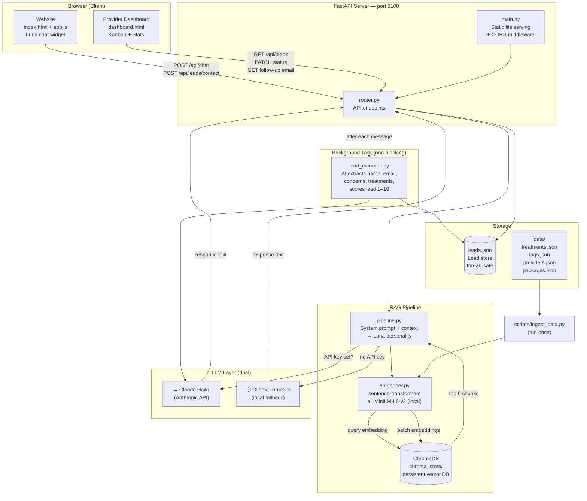

# Luminara Med Spa — Luna AI Wellness Consultant

[](https://med-spa-production.up.railway.app)
[](https://github.com/akabonge/med-spa)
[](https://fastapi.tiangolo.com)
[](https://anthropic.com)
[](https://trychroma.com)
[](https://ollama.ai)
[](https://aialo.io)

**Demo 3 of the AI Alo Portfolio**
A production-quality AI automation demo targeting med spa and aesthetic clinic owners in the Fredericksburg, VA area.

---

## What This Is

A full-stack AI assistant built for a fictional med spa — **Luminara Med Spa** in Fredericksburg, VA. It demonstrates how AI can handle client intake, treatment education, lead qualification, and provider follow-up — solving real operational pain points for small aesthetic businesses.

**Luna** is the AI wellness consultant embedded on the website. She recommends treatments based on stated concerns, screens for candidacy, captures consultation bookings, and feeds qualified leads into a provider dashboard.

---

## Features

### Client-Facing (Website)
- **Luna AI chat widget** — conversational treatment recommender + FAQ answering, powered by Claude (or Ollama as fallback)
- **Treatment recommender** — Luna asks about concerns (fine lines, volume loss, dark spots, etc.) and recommends specific treatments by name with pricing ranges
- **Candidacy screening** — Luna naturally weaves in safety questions before recommending injectables, laser, or chemical peels
- **Consultation booking flow** — captures name, email, and preferred date after the 3rd message
- **Premium med spa UI** — Cormorant Garamond + Jost typography, rose gold palette, animated chat widget

### Provider-Facing (Dashboard at `/dashboard`)
- **Kanban board** — leads organized into New Inquiries → Consult Booked → Converted
- **AI lead scoring (1–10)** — runs as a background task after each message, scored by treatment value and intent signals
- **Pipeline value estimate** — dollar estimate of revenue potential across active leads
- **Draft follow-up email** — one-click AI-generated personalized email per lead, opens in mail app
- **Auto-refresh** every 30 seconds
- **Score legend** explaining hot / warm / early tiers

---

## System Architecture



---

## Tech Stack

| Layer | Technology |
|---|---|
| Backend | FastAPI |
| Vector DB | ChromaDB (local, persistent) |
| Embeddings | sentence-transformers `all-MiniLM-L6-v2` (local, no API key) |
| Primary LLM | Anthropic Claude Haiku |
| Fallback LLM | Ollama (llama3.2) |
| Frontend | Vanilla HTML / CSS / JS |
| Lead storage | JSON file (thread-safe, single-process) |

---

## Setup

### 1. Clone and install
```bash
git clone https://github.com/akabonge/med-spa.git
cd med-spa
pip install -r requirements.txt
```

### 2. Configure environment
```bash
cp .env.example .env
# Add your Anthropic API key to .env (optional — falls back to Ollama without it)
```

### 3. Ingest knowledge base
```bash
python scripts/ingest_data.py
```
This embeds all treatments, FAQs, providers, and packages into ChromaDB. Run once, or re-run after editing any `data/` files.

### 4. Start the server
```bash
uvicorn app.main:app --port 8100 --reload
```

- **Website:** `http://localhost:8100`
- **Provider Dashboard:** `http://localhost:8100/dashboard`

---

## Knowledge Base

Located in `data/` — all Fredericksburg/Stafford/Spotsylvania area content:

| File | Contents |
|---|---|
| `treatments.json` | 10 treatments with descriptions, pricing, candidacy notes |
| `faqs.json` | 20 FAQs covering logistics, safety, pricing, and process |
| `providers.json` | 3 providers (MD, RN injector, aesthetician) |
| `packages.json` | 4 treatment packages with pricing and ideal candidates |

---

## Project Structure

```
luminara_medspa/
├── app/
│   ├── config.py          # Settings + .env loader
│   ├── models.py          # Pydantic schemas
│   ├── lead_store.py      # Thread-safe JSON lead persistence
│   ├── router.py          # API endpoints
│   ├── main.py            # FastAPI app + static file serving
│   └── rag/
│       ├── embedder.py    # sentence-transformers wrapper
│       ├── retriever.py   # ChromaDB query
│       ├── pipeline.py    # RAG + LLM response (Claude / Ollama)
│       └── lead_extractor.py  # Background AI lead scoring
├── data/                  # Knowledge base JSON files
├── scripts/
│   └── ingest_data.py     # One-time ChromaDB ingestion
├── frontend/
│   ├── index.html         # Main website with Luna chat
│   ├── dashboard.html     # Provider kanban dashboard
│   ├── style.css          # Premium med spa design system
│   └── app.js             # Chat widget logic
├── .env.example
├── .gitignore
└── requirements.txt
```

---

## API Endpoints

| Method | Path | Description |
|---|---|---|
| `POST` | `/api/chat` | Send a message to Luna |
| `POST` | `/api/leads/contact` | Save contact info from booking card |
| `GET` | `/api/leads` | List all leads (sorted by score) |
| `PATCH` | `/api/leads/{id}/status` | Update kanban status |
| `GET` | `/api/leads/{id}/follow-up` | Generate follow-up email draft |

---

## Part of the AI Alo Portfolio

| Demo | Business | Key Feature |
|---|---|---|
| Demo 1 | Casa Alo's Bistro | Restaurant RAG chatbot |
| Demo 2 | Rappahannock Realty Group | Lead qualifier + CRM dashboard |
| **Demo 3** | **Luminara Med Spa** | **Treatment recommender + candidacy screening** |

Built by [Aloysious Kabonge](https://github.com/akabonge) — AI automation consulting for local businesses in Fredericksburg, VA.
